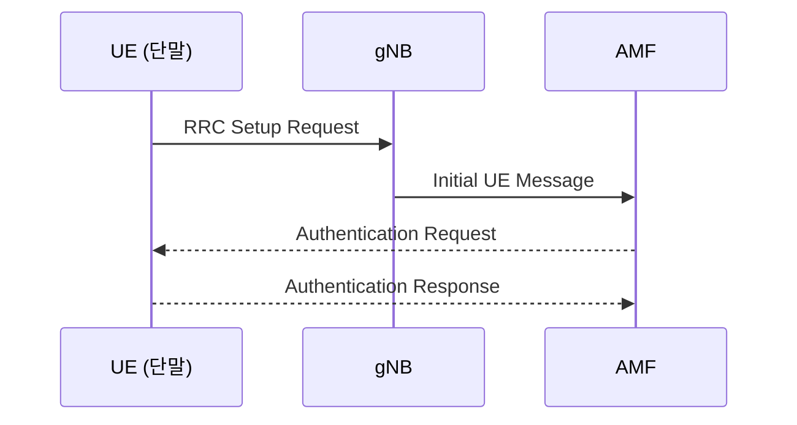
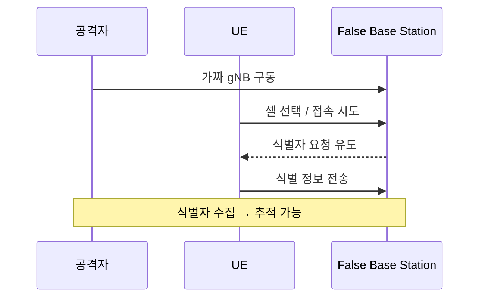
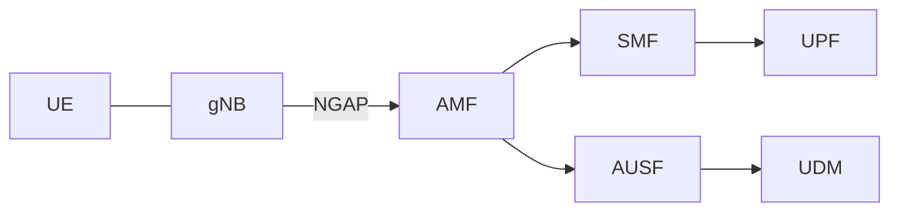

# 다이어그램 규칙 (Diagram Rules)

5G Security Knowledge Base 문서의 그림/다이어그램 작성 규칙입니다.

## 기본 원칙

1. **Mermaid를 기본으로 사용한다.** (텍스트 기반 → git diff 추적 가능, GitHub·GitBook 양쪽 렌더링)
2. Mermaid로 표현이 어려운 정교한 그림만 **SVG**로 만든다.
3. SVG/PNG 등 이미지 파일은 `.gitbook/assets/`에 모아 관리한다. (GitBook 표준 이미지 경로)
4. 스크린샷/스케치 같은 비정형 이미지는 최소화한다.

> **왜 Mermaid 우선인가**: 이 리포지토리는 GitHub ↔ GitBook 동기화로 운영된다.
> Mermaid는 두 플랫폼 모두에서 자동 렌더링되고, 텍스트라서 PR 리뷰와 변경 추적이 쉽다.
> 이미지 바이너리는 diff가 안 되고 리포지토리를 무겁게 만든다.

---

## 1. Mermaid 사용법

코드 블록에 `mermaid` 언어를 지정한다.

````markdown

````

### 안정적으로 지원되는 다이어그램 타입 (권장)
GitBook Mermaid 지원 범위를 고려해 아래 핵심 타입 위주로 사용한다.

| 타입 | 용도 | 5G 문서 활용 예 |
|------|------|-----------------|
| `sequenceDiagram` | 절차/시그널링 흐름 | 5G-AKA 인증, Registration, 공격 시나리오 |
| `flowchart` / `graph` | 구성도/의사결정 | 네트워크 아키텍처, 공격 트리, 대응 흐름 |
| `stateDiagram-v2` | 상태 전이 | UE 상태(RM/CM), 세션 상태 |
| `classDiagram` | 데이터 구조 | 키 계층, 식별자 관계 |
| `erDiagram` | 엔터티 관계 | NF 간 관계, 데이터 모델 |

- 최신 문법의 신규 타입(예: 일부 실험적 다이어그램)은 GitBook에서 렌더링이 안 될 수 있으므로 지양한다.
- 다이어그램은 **한 문서에 꼭 필요한 것만** 넣는다. 개요 설명을 대체하지 말고 보완한다.

### 라벨/한글 규칙
- 노드/참가자 라벨에 한글을 써도 되지만, 표준 용어(gNB, AMF, SUPI 등)는 영문 그대로 쓴다.
- 라벨에 특수문자(`:`, `;`, `#`, 괄호 조합)가 많으면 렌더링이 깨질 수 있으니 따옴표로 감싼다.
  예: `A["HTTP/2 (SBI)"]`

### 5G 문서용 스니펫 예시

**공격 시나리오 (sequenceDiagram)**
````markdown

````

**네트워크 구성도 (flowchart)**
````markdown

````

---

## 2. SVG 사용법

Mermaid로 표현이 어려운 경우에만 사용한다.

### 파일 위치 및 참조
```
.gitbook/assets/{설명적-파일명}.svg
```
```markdown

```
- 위치: `.gitbook/assets/` (GitBook 웹 에디터 업로드 기본 경로와 동일 → 직접 작성본과 업로드본 통합 관리)
- 참조 경로는 문서 위치 기준 상대경로. (카테고리 폴더 안 문서면 `../.gitbook/assets/...`)

### SVG 파일명 규칙 (중요)
SVG 파일명은 **그 이미지가 들어가는 문서 파일명(stem)을 prefix**로, **그림 설명을 suffix**로 붙인다.

```
{문서파일명}_{그림_설명}.svg
```

- 문서 파일명 stem을 그대로 prefix로 쓴다 → 어느 문서 그림인지 한눈에 보임.
- 뒤에 그림 설명(suffix)을 붙여 같은 문서의 여러 그림을 구분한다.
- 그림이 **하나뿐이면** suffix를 생략할 수 있다.
- **모든 파일명은 공백 없이 언더스코어(`_`)** 사용 (rules-authoring §2와 동일).

예시:
```
문서:  02-ue-privacy/02-05-False_Base_Station.md
SVG:   .gitbook/assets/02-05-False_Base_Station_attack_flow.svg   # 공격 흐름도
       .gitbook/assets/02-05-False_Base_Station_topology.svg      # 구성도
       .gitbook/assets/02-05-False_Base_Station.svg               # 그림 1개면 suffix 생략
```
> 여러 문서에서 공유되는 공통 개념도(특정 문서에 종속되지 않는 것)는 예외적으로 설명형 이름을 쓸 수 있다.
> 예: `common_5g_architecture.svg`. 단, 특정 문서 전용 그림은 위 prefix 규칙을 따른다.

### SVG 작성 규칙
- 뷰박스를 명시하고(`viewBox`), 고정 픽셀 크기에 의존하지 않게 한다.
- 텍스트는 `<text>` 요소로 넣어 편집/검색이 가능하게 한다 (이미지로 굽지 않음).
- 색상은 과하지 않게, 대비를 확보한다 (접근성).
- 가능하면 다크/라이트 배경 모두에서 읽히도록 배경 투명 + 충분한 대비.

### 최소 예시
```xml
<svg xmlns="http://www.w3.org/2000/svg" viewBox="0 0 320 120" role="img" aria-label="예시 다이어그램">
  <rect x="10" y="40" width="120" height="40" rx="6" fill="#e8f0fe" stroke="#1a73e8"/>
  <text x="70" y="65" text-anchor="middle" font-size="14">UE</text>
  <line x1="130" y1="60" x2="190" y2="60" stroke="#333" marker-end="url(#arrow)"/>
  <rect x="190" y="40" width="120" height="40" rx="6" fill="#e8f0fe" stroke="#1a73e8"/>
  <text x="250" y="65" text-anchor="middle" font-size="14">gNB</text>
  <defs>
    <marker id="arrow" markerWidth="8" markerHeight="8" refX="6" refY="3" orient="auto">
      <path d="M0,0 L6,3 L0,6 Z" fill="#333"/>
    </marker>
  </defs>
</svg>
```

### SVG를 쓸지 판단하는 기준
- Mermaid로 3번 시도해도 원하는 배치가 안 나온다 → SVG 고려
- 정형화된 구성도/계층도 → AI가 SVG 직접 작성 가능
- 3GPP 스펙 수준의 매우 정교한 그림 → draw.io 등 외부 툴 산출물을 SVG로 저장하는 것이 나을 수 있음

---

## 3. 접근성 / 품질

- 모든 다이어그램에는 그림이 안 보일 때를 대비한 **텍스트 설명**(본문 문장 또는 alt 텍스트)을 함께 둔다.
- 색상만으로 정보를 구분하지 않는다 (라벨 병기).
- 다이어그램이 문서 핵심 정보를 유일하게 담지 않도록 한다 (본문에도 설명).

---

## 4. 체크리스트

- [ ] 기본은 Mermaid로 작성했는가
- [ ] 사용한 Mermaid 타입이 권장(안정) 타입인가
- [ ] 특수문자 라벨을 따옴표로 감쌌는가
- [ ] SVG를 썼다면 `.gitbook/assets/`에 두고 상대경로로 참조했는가
- [ ] SVG 파일명이 `{문서파일명}_{설명}.svg` 규칙을 따르는가 (공백 없이 `_`)
- [ ] 그림에 대한 텍스트 설명이 본문/alt에 있는가
- [ ] GitHub와 GitBook 양쪽에서 렌더링되는지 확인했는가
