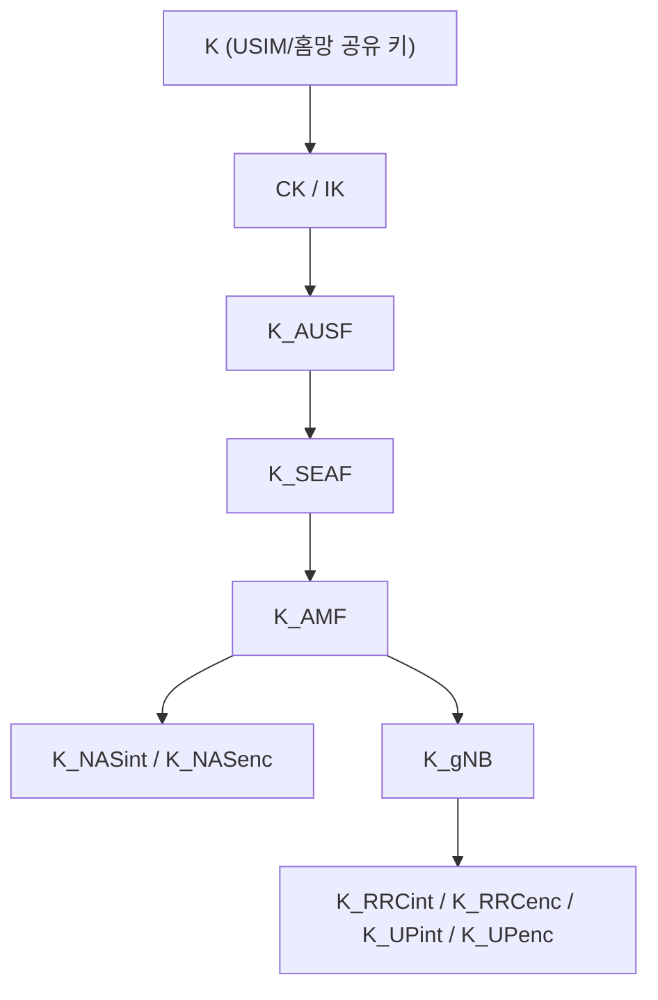
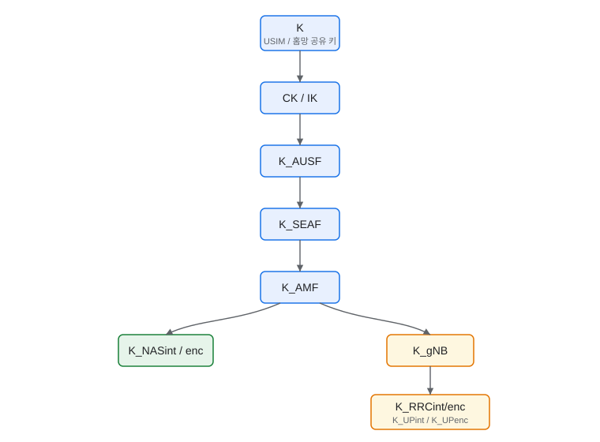

# 01-01. 5G Key Hierarchy

5G-AKA 인증 이후 UE와 네트워크가 공유하는 키가 어떻게 파생되는지를 나타낸 키 계층 구조다.
루트 키 `K`(USIM과 홈망이 공유)에서 시작해 단계적으로 하위 키가 유도되며, 각 키는 서로 다른 보호 범위(NAS, AS 등)를 담당한다.

이 문서는 **다이어그램 표현 방식 데모**를 겸한다. 같은 구조를 (1) Mermaid, (2) SVG 두 방식으로 보여준다.
(작성 규칙: `.kiro/steering/rules-diagrams.md`)

## 파생 흐름

```
K → CK/IK → K_AUSF → K_SEAF → K_AMF ┬→ K_NASint / K_NASenc
                                    └→ K_gNB → K_RRCint / K_RRCenc / K_UPint / K_UPenc
```

## 방식 1: Mermaid (기본 권장)

텍스트 기반이라 수정·버전관리가 쉽다. 대부분의 계층/흐름은 이걸로 충분하다.



## 방식 2: SVG (정교한 정형 그림)

Mermaid로 세밀한 배치가 어려울 때 사용한다. `.gitbook/assets/`에 두고 상대경로로 참조한다.



## 설명

- **K**: USIM과 홈망(UDM/ARPF)이 공유하는 루트 키.
- **CK/IK**: 인증 과정에서 생성되는 암호화/무결성 키.
- **K_AUSF → K_SEAF → K_AMF**: 홈망·서빙망·AMF 단계로 내려오며 파생되는 앵커 키 계열.
- **K_NASint/enc**: AMF와 UE 사이 NAS 시그널링 보호 키.
- **K_gNB**: 기지국(gNB)용 키. 여기서 다시 AS(Access Stratum) 키가 파생된다.
- **K_RRCint/enc, K_UPint/enc**: RRC 시그널링·사용자 평면 데이터 보호 키.

## 7. 3GPP / O-RAN 표준

TS 33.501

> 상세 정의는 [12. 3GPP / O-RAN 표준](../12-3gpp-standards/README.md) 참조. 5G 키 계층과 파생 함수는 TS 33.501에 정의된다.
