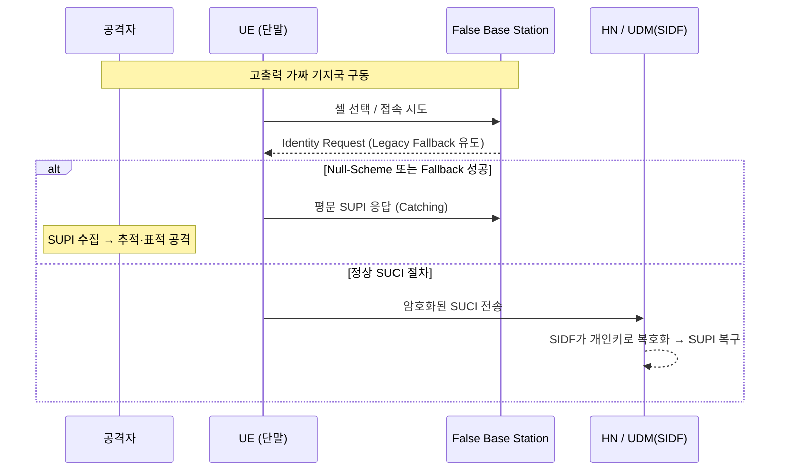

# 02-01. SUPI Exposure

## 1. 개요 (What)

SUPI Exposure는 5G 가입자의 유일한 영구 식별자인 **SUPI(Subscription Permanent Identifier)**가 공격자에게 노출되는 문제다. SUPI는 4G의 IMSI에 대응하는 핵심 자산으로, SIM(USIM)에 저장되며 5G 보안 아키텍처의 신뢰 앵커(Trust Anchor) 역할을 한다. 5G는 설계 단계부터 SUPI가 무선 구간(Air Interface)에 평문으로 노출되지 않도록 고안되었다.

이를 위해 5G는 **SUCI(Subscription Concealed Identifier)**를 도입했다. SUCI는 비대칭 암호화(ECIES)로 SUPI를 은폐한 식별자로, 평문 IMSI를 무선 구간에 그대로 노출했던 4G의 구조적 결함을 해결한다. 5G 표준은 초기 접속 시 오직 암호화된 SUCI만 전송하도록 규정한다.

그럼에도 설정 오류(Null-Scheme), 초기 비암호화 시그널링 구간, 가짜 기지국 유인 등으로 SUPI가 노출되면 그 파급력은 크다. 단순 개인정보 유출을 넘어 5G 신뢰 모델이 무력화되고, 위치·신원 추적, Paging Attack·Targeted DoS·Signaling Spoofing 같은 고도화된 후속 표적 공격의 발판이 마련된다.

### 1.1 가입자 식별자 포맷 및 필드 구조

**SUPI 포맷 (3GPP TS 23.003 Sec 2.2)** — Section 2.2(SUPI 구조 & IMSI 매핑) / Section 28.2

```text
+-------------------------------------------------------------------+
|               SUPI Format (3GPP TS 23.003 Sec 2.2)                |
+-------------------+-------------------+---------------------------+
|    MCC (3 dgt)    |  MNC (2 or 3 dgt) |       MSIN (9-10 dgt)     |
| (Mobile Cntry Cd) | (Mobile Ntwk Cd)  |  (Subscr Stn Ident Nbr)   |
+-------------------+-------------------+---------------------------+
|              Plaintext Area           |  ★ Target for Encryption ★|
+---------------------------------------+---------------------------+
```

**SUCI 포맷 (3GPP TS 23.003 Sec 28.3 / TS 33.501 Sec 6.12)** — 데이터 구조는 TS 23.003 Sec 28.3, 보안 아키텍처는 TS 33.501 Sec 6.12(Subscription Identifier Privacy)

```text
+--------------------------------------------------------------------------------------------------------------------------+
|                          SUCI Format (3GPP TS 23.003 Sec 28.3 / TS 33.501 Sec 6.12)                                      |
+-----------+------------+------------+-------------------+----------------------+--------------------+--------------------+
| SUPI Type |    MCC     |    MNC     | Routing Indicator | Protection Scheme ID | Home Net PK ID     |   Scheme Output    |
| (1 Byte)  |  (3 dgt)   | (2-3 dgt)  |    (4 Hex dgt)    |       (1 Byte)       |     (1 Byte)       |  (Var-Length Bytes)|
+-----------+------------+------------+-------------------+----------------------+--------------------+--------------------+
| Type ID   | Country    | Network    | Target UDM/AUSF   | Crypto Algorithm ID  | Public Key Version | Encrypted MSIN     |
| (e.g. 0)  | Code       | Code       | Routing Code      | (0x0:Null, 0x1/2:EC) | Number of HN       | (Ciphertext + MAC) |
+-----------+------------+------------+-------------------+----------------------+--------------------+--------------------+
|<----------------------- Plaintext Area (Header for Routing) ------------------------------------->|<-- Encrypted Area -|
```

**Protection Scheme ID 규격 (3GPP TS 33.501 Annex C.2)**

- `0x0`: Null-Scheme (No Encryption)
- `0x1`: Profile A (ECIES Sequence — Curve25519)
- `0x2`: Profile B (ECIES Sequence — Secp256r1)

> MCC와 MNC는 홈 네트워크(HN)로의 정확한 패킷 라우팅을 위해 반드시 평문(Plaintext)으로 유지되어야 한다. 실제 암호화 대상은 MSIN이다.

### 1.2 End-to-End 은폐/복원 흐름 (3GPP TS 33.501 Sec 6.12.2)

SUCI 생성(Calculation)과 복호화(De-concealment) 절차는 TS 33.501 Sec 6.12.2 및 Annex C.3(ECIES 연산)에 정의된다.

```text
[ User Equipment (UE) ]
  │  (3GPP TS 33.501 Annex C.3 - ECIES Calculation)
  ├─ 1. Generate Raw SUPI (TS 23.003 Sec 2.2)
  │     └─ [ MCC: 450 ] [ MNC: 05 ] [ MSIN: 01012345678 ]
  │
  ├─ 2. Asymmetric Encryption via ECIES (Home Net Public Key)
  │     └─ MSIN --------------------------------------------┐
  │                                                         ▼
  ├─ 3. Construct SUCI Packet (TS 23.003 Sec 28.3)    [ Scheme Output ]
  │     └─ [ 0x0 | 450 | 05 | 0001 | 0x1 | 0x01 | 8f9a2b...c3d4e5f ]
  │
  └─( Air Interface : 3GPP TS 38.331 RRC / TS 24.501 NAS )──┐
                                                            │
                                                            ▼
[ Home Network (5G Core UDM / SIDF) ]
  │  (3GPP TS 33.501 Sec 6.12.2 - De-concealment via SIDF)
  ├─ 1. Receive SUCI & Route Packet by Header (MCC: 450, MNC: 05)
  │
  ├─ 2. Asymmetric Decryption via ECIES (Home Net Private Key at SIDF)
  │     └─ [ Scheme Output ] ───────────( Decrypt )────────┐
  │                                                        ▼
  └─ 3. Restore Original SUPI                         [ MSIN: 01012345678 ]
        └─ [ MCC: 450 ] [ MNC: 05 ] [ MSIN: 01012345678 ]
```

> 핵심: UE는 HN 공개키로 MSIN만 암호화해 SUCI를 만들고, 라우팅용 헤더(MCC/MNC 등)는 평문으로 남긴다.
> HN의 SIDF(Subscription Identifier De-concealing Function)만이 개인키로 복호화해 원본 SUPI를 복원할 수 있다.

## 2. 공격 대상 (Target)

| 대상 | 설명 |
|------|------|
| UE (USIM) | SUPI 저장 및 SUCI 생성 로직 |
| RAN (Uu 무선 구간) | UE ↔ gNB 초기 접속/식별자 전송 구간 |
| 초기 NAS 시그널링 | NAS SMC(Security Mode Control) 완료 이전 구간 |
| HN / UDM(SIDF) | SUCI 복호화 및 SUPI 복구 지점 |

핵심 표면은 **상호 인증(5G-AKA)과 보안 컨텍스트가 아직 확립되기 전인 초기 접속·등록 구간**이다. 이 구간에서 암호화가 누락되거나 우회되면 SUPI가 그대로 노출된다.

## 3. 취약점 (Why possible)

SUPI 노출을 유발하는 핵심 메커니즘은 크게 세 가지다.

1. **Null-Scheme (운영 설정 오류)**: 3GPP TS 33.501이 테스트 목적으로 정의한 `0x0(Null-Scheme)`이 상용 환경에서 활성화된 경우다. PKI 프로비저닝 실패나 설정 오류로 암호화가 누락되면, 패킷은 SUCI 형식을 띠지만 내부에는 평문 SUPI가 담겨 무선 스니핑에 노출된다.
2. **초기 비암호화 구간 (Initial Unprotected Signaling)**: 초기 NAS 등록 절차 중 NAS SMC 완료 이전의 보안 공백을 악용한다. 암호화 키 수립 전 전송되는 Registration Request 내 식별자·보안 역량(Capability) 정보가 중간자 공격(MITM)에 탈취될 수 있다.
3. **가짜 기지국 유인 (Rogue gNB / FBS)**: 공격자가 고출력 가짜 기지국으로 단말 접속을 유도한 뒤 Identity Request를 보낸다. 단말이 SUCI 표준 절차를 우회해 예외 처리(Legacy Fallback)를 수행하도록 유도하면, 단말이 스스로 평문 SUPI를 응답(Catching)하게 만들 수 있다.

**4G와의 차이**: 4G는 평문 IMSI를 무선 구간에 노출하는 구조였으나, 5G는 SUCI(ECIES) 도입으로 이를 원천 차단하도록 설계됐다. 다만 위 세 메커니즘처럼 설정·구현·절차상의 갭이 남으면 5G에서도 노출이 발생한다.

## 4. 공격 시나리오 (Attack Scenario)



단계 설명:
1. 공격자가 강한 신호의 가짜 기지국으로 단말 접속을 유도한다.
2. FBS가 Identity Request를 보내 SUCI 절차 우회(Legacy Fallback)를 유도한다.
3. Null-Scheme이 활성화됐거나 우회가 성공하면 단말이 평문 SUPI를 응답한다.
4. 공격자는 수집한 SUPI로 위치 추적, Paging Attack, Targeted DoS 등 후속 공격을 수행한다.

## 5. 영향 (Impact)

| 관점 | 영향 |
|------|------|
| 기밀성 (Confidentiality) | 영구 식별자 SUPI 노출 → 가입자 신원 유출 |
| 무결성 (Integrity) | 탈취된 식별자 기반 Signaling Spoofing 가능 |
| 가용성 (Availability) | Targeted DoS, Paging Attack 등 후속 공격의 발판 |
| 프라이버시 (Privacy) | 이동 경로·체류 장소·통신 패턴에 대한 정밀 추적·감시 |

SUPI는 영구 식별자이므로 한 번 노출되면 재발급이 어렵고, 신뢰 앵커가 붕괴되어 통신 인프라의 신뢰 모델 전반이 위협받는다.

## 6. 대응 방안 (Countermeasure)

**표준·기술적 통제**
- 상용 환경에서 Null-Scheme(`0x0`) 사용 금지, 반드시 Profile A/B(ECIES) 적용
- HN 공개키의 올바른 프로비저닝 및 키 버전(Home Net PK ID) 관리
- Encrypted NAS Container(Protected Initial NAS)로 초기 단계 민감 필드 암호화 (Rel-16/17)
- Security Mode Command 교환 시 초기 메시지 무결성 사후 검증 → Downgrade 공격 탐지·차단
- 관련: [02-03 SUCI Null Scheme](02-03-SUCI_Null_Scheme.md), [02-04 SUCI Misconfiguration](02-04-SUCI_Misconfiguration.md), [02-05 False Base Station](02-05-False_Base_Station.md)

**탐지·운영 통제**
- SUCI가 아닌 평문 SUPI 전송 여부 모니터링 (설정 오류 조기 탐지)
- 비정상 셀·Identity Request 패턴 모니터링으로 FBS 유인 탐지
- SBA/Zero Trust 원칙 적용 — 하드웨어 신뢰 뿌리(Root of Trust)와 결합해 가상화·클라우드 인프라 취약점까지 통합 관리

## 7. 3GPP / O-RAN 표준

TS 33.501

> 상세 정의는 [12. 3GPP / O-RAN 표준](../12-3gpp-standards/README.md) 참조.
>
> - **TS 33.501**: 5G 보안 아키텍처. SUCI 생성을 위한 ECIES 프로파일(Profile A: Curve25519 / Profile B: secp256r1)과 SIDF 복호화 절차, Encrypted NAS Container를 정의한다.
> - **TS 23.003**: SUPI/SUCI의 필드 구조·비트 할당 규격 정의 (MSIN이 암호화 핵심 대상).
> - **TS 24.501 (NAS) / TS 38.331 (RRC)**: 식별자 교환 및 보안 모드 설정 등 시그널링 규격.

## 8. 관련 US 가이드라인

US-2

> 상세 정의는 [14. US 보안 가이드라인](../14-nist-series/README.md) 참조. US-2(NIST CSWP 36A)는 SUCI를 통한 가입자 식별자 보호를 다룬다.
>
> - **CSWP 36A**: 상용 환경에서 Null-Scheme 사용을 엄격히 금지하고, HN 공개키 관리 체계를 강화한다. 3GPP가 Optional로 둔 보안 기능을 Mandatory로 전환하는 관점.
> - **CSWP 36F**: 초기 NAS 보안 강화(Encrypted NAS Container, 무결성 사후 검증)를 통해 Downgrade 공격을 차단한다.

## 9. 관련 EU 가이드라인

EU-1

> 상세 정의는 [13. EU 보안 프레임워크](../13-enisa-framework/README.md) 참조. EU-1(ENISA 5G Threat Landscape)은 가입자 식별자 노출 및 추적을 5G 위협 지형의 한 항목으로 다룬다.

## 10. 참조 논문

P1, P2

> 상세 정의는 [15. 참조 논문](../15-research-papers/README.md) 참조. 5G SA 공격 표면 분석 논문에서 SUPI/SUCI 노출 및 식별자 추적 계열 공격을 다룬다.

---

## 관련 이슈
- [02-02 IMSI-SUPI Catching](02-02-IMSI-SUPI_Catching.md)
- [02-03 SUCI Null Scheme](02-03-SUCI_Null_Scheme.md)
- [02-04 SUCI Misconfiguration](02-04-SUCI_Misconfiguration.md)
- [02-05 False Base Station](02-05-False_Base_Station.md)

## 출처
- 3GPP, TS 23.003 "Numbering, addressing and identification". (표준)
- 3GPP, TS 33.501 "Security architecture and procedures for 5G System". (표준)
- NIST, CSWP 36A "Protecting Subscriber Identifiers with SUCI". (US-2)
- NIST, CSWP 36F "5G Cybersecurity White Paper". (US-2 계열)
- ENISA, "Threat Landscape for 5G Networks". (EU-1)

> 위 내용은 원문을 그대로 옮긴 것이 아니라 핵심을 한국어로 재구성한 해설이다.
