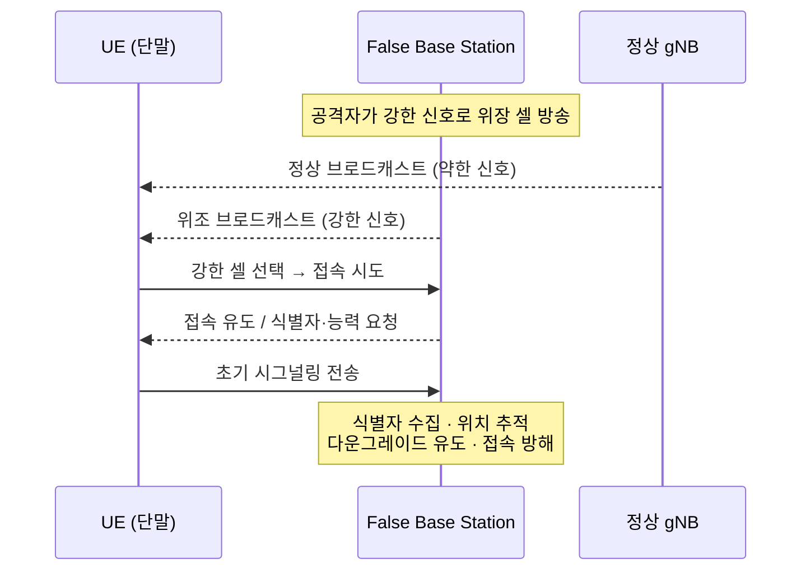

# 02-05. False Base Station

## 1. 개요 (What)

False Base Station(FBS, 가짜 기지국)은 공격자가 정상 gNB(5G 기지국)처럼 위장한 무선 장비를 운용하여, 주변 UE(단말)가 진짜 네트워크 대신 공격자의 장비에 접속하도록 유인하는 공격이다. IMSI Catcher, Stingray 등으로도 알려진 이 공격 계열은 4G(LTE)에서 널리 문제가 되었고, 5G에서도 초기 접속 단계의 특성상 완전히 사라지지 않았다.

UE는 셀 선택 시 신호가 강한 셀을 선호하는 특성이 있으므로, 공격자가 강한 신호로 위장 셀을 방송하면 UE를 끌어들일 수 있다. 일단 UE가 FBS에 접속하면 공격자는 식별자 수집, 위치 추적, 다운그레이드 유도, 서비스 거부 등 다양한 후속 공격을 시도할 수 있다.

5G는 SUCI(가입자 식별자 암호화) 도입으로 4G 대비 식별자 노출을 크게 줄였으나, FBS는 여전히 가용성 공격(접속 방해)과 일부 프라이버시 공격(패턴 관찰, 다운그레이드 유도)의 진입점으로 활용될 수 있다. 3GPP는 이 문제를 별도 연구 과제(TR 33.809)로 다루고 있다.

## 2. 공격 대상 (Target)

| 대상 | 설명 |
|------|------|
| UE | 셀 선택/재선택 로직, 초기 접속 절차 |
| RAN (Uu 무선 구간) | UE ↔ gNB 사이 초기 브로드캐스트/RRC 구간 |
| 초기 시그널링 | RRC 연결 설정, Initial NAS 메시지 교환 이전 단계 |

핵심은 **UE와 네트워크 간 상호 신뢰가 아직 확립되기 전인 초기 접속 구간**이다. 인증(5G-AKA)이 완료되기 전 단계이므로, UE는 접속하려는 셀이 진짜인지 확신하기 어렵다.

## 3. 취약점 (Why possible)

- **브로드캐스트 정보의 무결성 보호 부재**: 셀 선택에 사용되는 System Information(SIB) 등 초기 브로드캐스트 메시지는 UE가 인증하기 전에 수신하므로, 위조·조작을 즉시 검증하기 어렵다.
- **셀 선택의 신호 강도 의존**: UE는 더 강한 신호의 셀을 선호하므로, 공격자가 근거리에서 강한 위장 셀을 방송하면 유인이 가능하다.
- **인증 이전 단계의 신뢰 공백**: 상호 인증(5G-AKA)은 접속 이후 이뤄지므로, 그 이전 구간에는 공격 표면이 남는다.
- **4G와의 차이**: 5G는 SUCI로 SUPI를 암호화해 식별자 수집을 어렵게 만들었지만, 초기 브로드캐스트 보호나 셀 진위 검증은 여전히 연구·강화가 진행 중인 영역이다(TR 33.809).

## 4. 공격 시나리오 (Attack Scenario)

단계 설명:
1. 공격자가 정상 셀보다 강한 신호로 위장 셀을 방송한다.
2. UE는 신호 강도 기준으로 위장 셀을 선택해 접속을 시도한다.
3. FBS는 UE에게 식별자/단말 능력 정보를 요청하거나 초기 시그널링을 유도한다.
4. 공격자는 수집한 정보로 추적을 시도하거나, 접속을 반복적으로 방해(가용성 공격)하거나, 약한 보안 상태로의 다운그레이드를 유도한다.

## 5. 영향 (Impact)

| 관점 | 영향 |
|------|------|
| 기밀성 (Confidentiality) | 식별자·단말 능력 등 초기 정보 노출 가능 (SUCI 적용 시 SUPI 노출은 제한됨) |
| 무결성 (Integrity) | 위조 브로드캐스트/시그널링 주입 가능 |
| 가용성 (Availability) | 접속 유인 후 서비스 거부, 정상망 접속 방해 |
| 프라이버시 (Privacy) | 위치 추적, 접속 패턴 관찰을 통한 사용자 식별 시도 |

## 6. 대응 방안 (Countermeasure)

**표준·기술적 통제**
- SUCI 사용으로 초기 식별자(SUPI) 노출 최소화 (관련: [02-01 SUPI Exposure](02-01-SUPI_Exposure.md), [02-04 SUCI Misconfiguration](02-04-SUCI_Misconfiguration.md))
- 3GPP TR 33.809에서 검토 중인 브로드캐스트/System Information 보호 및 셀 진위 검증 메커니즘 적용
- 상호 인증(5G-AKA) 절차 준수 및 다운그레이드 방지 (관련: [03-07 NAS Security Downgrade](../03-auth-nas/03-07-NAS_Security_Downgrade.md))

**탐지·운영 통제**
- 비정상 셀(예상치 못한 PCI/주파수, 급격한 신호 변화) 모니터링
- UE 측정 리포트 및 네트워크 이벤트 상관 분석으로 위장 셀 탐지
- 사업자의 셀 진위/설정 무결성 관리

## 7. 3GPP / O-RAN 표준

TR 33.809

> 상세 정의는 [12. 3GPP / O-RAN 표준](../12-3gpp-standards/README.md) 참조. TR 33.809는 False Base Station 대응을 위한 보안 강화 연구 보고서다.

## 8. 관련 US 가이드라인

US-2

> 상세 정의는 [14. US 보안 가이드라인](../14-nist-series/README.md) 참조. US-2(NIST CSWP 36A)는 SUCI를 통한 가입자 식별자 보호를 다룬다 — FBS의 식별자 수집을 완화하는 관점.

## 9. 관련 EU 가이드라인

EU-1

> 상세 정의는 [13. EU 보안 프레임워크](../13-enisa-framework/README.md) 참조. EU-1(ENISA 5G Threat Landscape)은 Rogue/False Base Station을 5G 위협 지형의 한 항목으로 다룬다.

## 10. 참조 논문

P1

> 상세 정의는 [15. 참조 논문](../15-research-papers/README.md) 참조. P1(*A survey of existing attacks on 5G SA*, 2025)은 UE/RAN 공격의 하나로 FBS 계열을 분석한다.

---

## 관련 이슈
- [02-02 IMSI-SUPI Catching](02-02-IMSI-SUPI_Catching.md)
- [02-06 Rogue gNB](02-06-Rogue_gNB.md)
- [02-01 SUPI Exposure](02-01-SUPI_Exposure.md)

## 출처
- 3GPP, TR 33.809 "Study on 5G security enhancements against false base stations (FBS)". (표준)
- ENISA, "Threat Landscape for 5G Networks". (EU-1)
- NIST, CSWP 36A "Protecting Subscriber Identifiers with SUCI". (US-2)
- 논문 P1 (참조 논문 정의 참고)

> 위 내용은 원문을 그대로 옮긴 것이 아니라 핵심을 한국어로 재구성한 해설이다.
