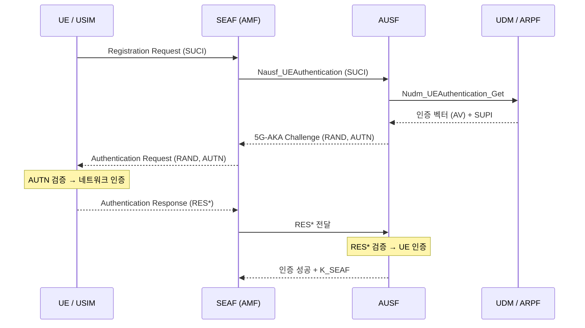
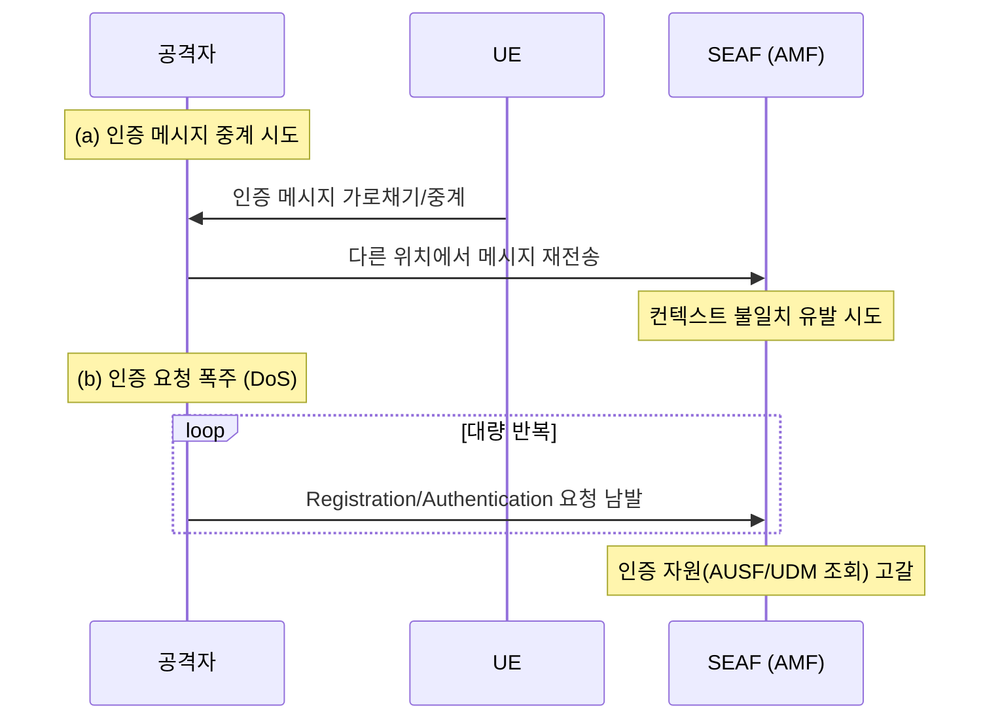

# 03-01. 5G-AKA Attack Surface

## 1. 개요 (What)

5G-AKA(Authentication and Key Agreement)는 5G에서 UE와 네트워크가 서로를 인증하고 공유 키를 합의하는 핵심 절차다. USIM에 저장된 장기 키 `K`를 기반으로 상호 인증을 수행하며, 이 과정에서 이후 통신을 보호할 키 계층(K_AUSF, K_SEAF, K_AMF 등)이 파생된다.

5G-AKA는 4G-AKA를 개선해 SUCI(암호화된 가입자 식별자)와 홈망 제어 강화를 도입했지만, 인증 절차 자체를 대상으로 하는 공격면은 여전히 존재한다. 인증 메시지의 중계·재전송, 인증 컨텍스트 관리 오류, 인증 요청 폭주를 통한 자원 고갈 등이 대표적이다.

이 문서는 5G-AKA 인증 절차를 대상으로 한 **공격면(attack surface)**을 다룬다.

## 2. 공격 대상 (Target)

| 대상 | 설명 |
|------|------|
| UE / USIM | 장기 키 `K` 보관, 인증 응답(RES*) 생성 |
| SEAF (AMF 내) | 서빙망 측 인증 앵커, 인증 요청 개시 |
| AUSF | 홈망 측 인증 서버, 인증 벡터 검증 |
| UDM/ARPF | 인증 벡터 생성, `K` 관리 |
| 인증 메시지 흐름 | SUCI, Authentication Request/Response, RES* 등 |

## 3. 취약점 (Why possible)

- **절차 상태 관리의 복잡성**: 인증은 여러 NF(SEAF/AUSF/UDM)를 거치는 다단계 절차라, 컨텍스트 동기화 오류나 상태 불일치가 공격면이 된다.
- **중계/재전송 가능성**: 인증 메시지 자체가 유효하더라도, 이를 다른 위치/시점에 중계하거나 재전송하는 공격(relay/replay)이 시도될 수 있다. (연관: [03-04 Authentication Relay](03-04-Authentication_Relay.md))
- **자원 소모**: 인증은 계산·시그널링 비용이 있어, 대량 인증 요청으로 자원을 고갈시키는 DoS가 가능하다. (연관: [03-03 Authentication DoS](03-03-Authentication_DoS.md))
- **구현/설정 편차**: 표준이 보안 기능을 정의해도 운영 구현에 따라 컨텍스트 노출·다운그레이드 여지가 남는다.

## 4. 공격 시나리오 (Attack Scenario)

### 4.1 정상 5G-AKA 절차 (기준)

정상 흐름을 먼저 이해해야 공격 지점이 보인다.

### 4.2 공격 예: 인증 중계 / 자원 고갈

단계 설명:
- (a) 유효한 인증 메시지를 가로채 다른 위치/시점에 중계·재전송해 인증 절차를 우회하거나 컨텍스트를 교란한다.
- (b) 대량 인증 요청으로 SEAF/AUSF/UDM의 인증 처리 자원을 소모시켜 정상 가입자 인증을 방해한다.

## 5. 영향 (Impact)

| 관점 | 영향 |
|------|------|
| 기밀성 (Confidentiality) | 인증 컨텍스트 노출 시 후속 키 유출 위험 |
| 무결성 (Integrity) | 인증 절차 교란으로 잘못된 보안 컨텍스트 수립 |
| 가용성 (Availability) | 인증 DoS로 신규 접속/재인증 방해 |
| 프라이버시 (Privacy) | 인증 흐름 관찰을 통한 부가 정보 수집 시도 |

## 6. 대응 방안 (Countermeasure)

**표준·기술적 통제**
- TS 33.501이 정의한 5G-AKA 절차 준수: AUTN 기반 네트워크 인증, RES* 검증, 홈망 제어(AUSF) 유지
- SUCI 사용으로 인증 개시 시 식별자 노출 최소화 (연관: [02-04 SUCI Misconfiguration](../02-ue-privacy/02-04-SUCI_Misconfiguration.md))
- 다운그레이드/재전송 방지 메커니즘 적용 (연관: [03-07 NAS Security Downgrade](03-07-NAS_Security_Downgrade.md))

**탐지·운영 통제**
- 인증 실패율·요청률 모니터링으로 DoS/중계 이상 징후 탐지
- 인증 컨텍스트 수명·동기화 관리 (연관: [03-06 Security Context Desynchronization](03-06-Security_Context_Desynchronization.md))
- 비정상 위치/패턴의 인증 요청 상관 분석

## 7. 3GPP / O-RAN 표준

TS 33.501

> 상세 정의는 [12. 3GPP / O-RAN 표준](../12-3gpp-standards/README.md) 참조. 5G-AKA 인증 절차와 키 파생은 TS 33.501에 정의된다.

## 8. 관련 US 가이드라인

US-1

> 상세 정의는 [14. US 보안 가이드라인](../14-nist-series/README.md) 참조. US-1(NIST CSWP 36 시리즈)은 5G 보안 기능의 구현·검증 관점을 다룬다.

## 9. 관련 EU 가이드라인

EU-3

> 상세 정의는 [13. EU 보안 프레임워크](../13-enisa-framework/README.md) 참조. EU-3(ENISA Security in 5G Specifications)은 3GPP 보안 규격상의 인증 관련 통제를 해설한다.

## 10. 참조 논문

P1, P2

> 상세 정의는 [15. 참조 논문](../15-research-papers/README.md) 참조. P1(5G SA 공격 survey)·P2(5G 보안 survey)가 인증 관련 공격을 다룬다.

---

## 관련 이슈
- [03-03 Authentication DoS](03-03-Authentication_DoS.md)
- [03-04 Authentication Relay](03-04-Authentication_Relay.md)
- [03-06 Security Context Desynchronization](03-06-Security_Context_Desynchronization.md)
- [01-01 5G Key Hierarchy](../01-fundamentals/01-01-5G_Key_Hierarchy.md)

## 출처
- 3GPP, TS 33.501 (5G System 보안 아키텍처 및 절차). (표준)
- NIST, CSWP 36 시리즈. (US-1)
- ENISA, "Security in 5G Specifications". (EU-3)
- 논문 P1, P2 (참조 논문 정의 참고)

> 위 내용은 원문을 그대로 옮긴 것이 아니라 핵심을 한국어로 재구성한 해설이다.
